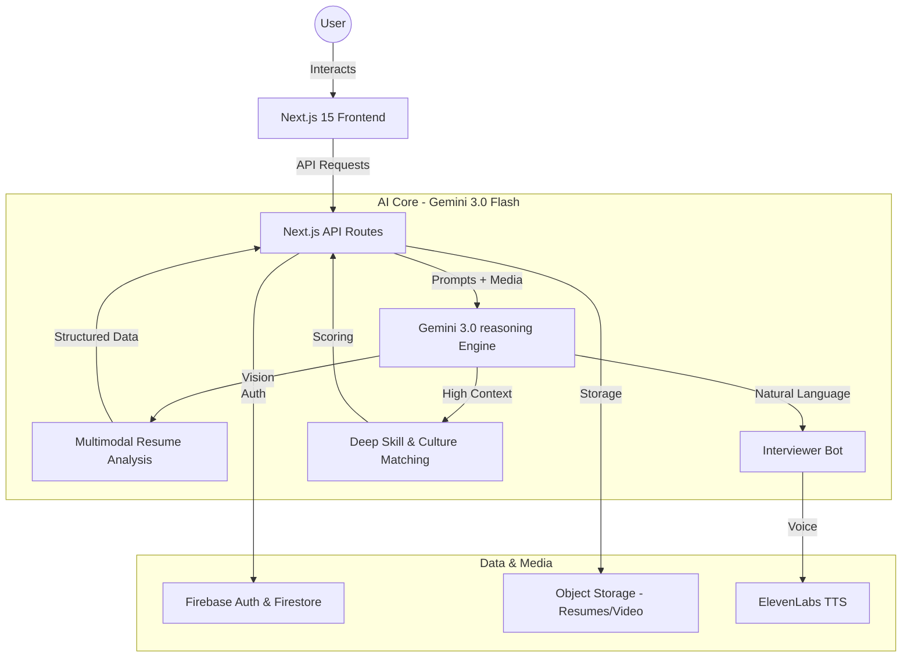

# HireVision: Architectural Blueprint

This document outlines the high-level architecture of HireVision, focusing on the seamless integration of **Google Gemini 3.0 Flash** across the recruitment lifecycle.

## 🏗 System Architecture

HireVision is built with a modern, scalable stack designed for low-latency AI interactions and multimodal data processing.

## 🧠 Gemini 3 Integration Touchpoints

### 1. Multimodal Resume Reasoning (Vision)
HireVision doesn't just parse text; it "sees" the candidate's presentation. By sending PDF and Image buffers directly to the Gemini 3 vision model, we extract:
- Visual hierarchy and emphasis.
- Portfolio design quality.
- Nuanced skill clusters often lost in standard OCR.

### 2. Intelligent Interview Engine (Reasoning)
The interview bot uses Gemini's advanced reasoning to conduct adaptive interviews. It doesn't follow a script; it probes deeper into candidate answers, identifies vague responses, and assesses technical depth in real-time.

### 3. Culture Fit & Soft Skill Analytics
Leveraging the 1M+ context window, HireVision analyzes long-form interview transcripts and extensive resumes to identify alignment with company values, communication style, and leadership potential.

### 4. Low-Latency Voice Interaction
By combining Gemini 3's fast processing with ElevenLabs, we provide a natural, human-like interviewing experience with minimal conversation lag, mimicking a real human interaction.

---

## 🛠 Tech Stack Summary

- **Frontend**: Next.js 15 (App Router), Tailwind CSS, Framer Motion.
- **AI**: Google Gemini 3.0 Flash.
- **Database**: Firebase Firestore (Real-time updates).
- **Authentication**: Firebase Authentication.
- **Voice**: ElevenLabs API.
- **Deployment**: Vercel / Cloud Infrastructure.
